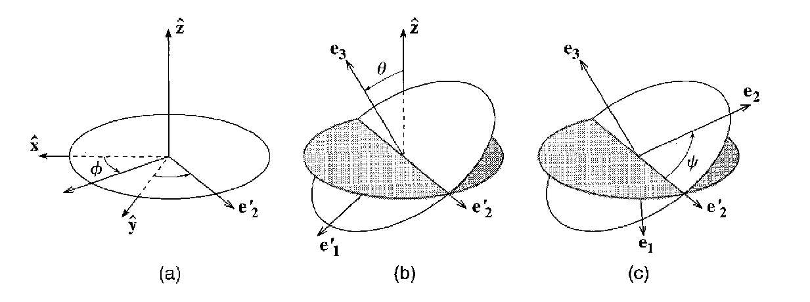

# Physics 427 Homework 6

__Due 11:59pm Wednesday 10/16/2023__

This homework is longer than usual, since it's like two homeworks bundled together. We will apply our ODE solver to some math/physics problems, and visualize the results. 

## 1. Motion of a Spinning Top (20 points)

The orientation of a spinning top is best characterized by three Euler angles. There are multiple ways to define Euler angles, but we will adopt the one used in the book "Classical Mechanics" by John R. Taylor. The three Euler angles $\phi$, $\theta$ and $\psi$ uniquely determine the orientation of the body axes of a rigid body $\mathbf{e}_1$, $\mathbf{e}_2$, and $\mathbf{e}_3$ with respect to the global $\hat{\mathbf{x}}$, $\hat{\mathbf{y}}$, and $\hat{\mathbf{z}}$ axes:



You can think of the first two angles $\phi$ and $\theta$ essentially the same as the corresponding angles in spherical coordinates, marking the direction of the body axis $\mathbf{e}_3$, and the final angle $\psi$ simply specifying the overall rotation of the object with respect to the axis $\mathbf{e}_3$.

We are interested in the motion of a spinning top that is symmetric around its body axis $\mathbf{e}_3$. For such a rigid body, two of its principal moments of inertia are equal, $\lambda_1 = \lambda_2$. One can write down its Lagrangian using Euler angles, assuming that it's balanced at a singular point and its center of mass is distance $R$ away from that balance point:

$$
\mathcal{L} = \frac{1}{2}\lambda_1(\dot{\phi}^2\sin^2\theta + \dot{\theta}^2) + \frac{1}{2}\lambda_3(\dot{\psi} + \dot{\phi}\cos\theta)^2 - MgR\cos\theta,
$$

where $\lambda_1$ and $\lambda_3$ are its principal moments of inertia along axes $\mathbf{e}_1$ and $\mathbf{e}_3$, $M$ is its mass, and $g$ is the gravitational acceleration. The corresponding Euler-Lagrange equations can be found to be:

$$
\begin{split}
\lambda_{1}\ddot{\theta} &= \lambda_{1}\dot{\phi}^{2}\sin\theta\cos\theta -\lambda_{3}(\dot{\psi} + \dot{\phi}\cos\theta)\dot{\phi}\sin\theta + MgR\sin\theta, \\
\dot{\phi} &= \frac{L_{z} - L_{3}\cos\theta}{\lambda_{1} \sin^{2}\theta}, \\
\dot{\psi} &= \frac{L_{3}}{\lambda_{3}} - \frac{L_{z} - L_{3}\cos\theta}{\lambda_{1} \sin^{2}\theta}\cos\theta,
\end{split}
$$
where $L_3$ and $L_z$ are conserved momenta along the body axis $\mathbf{e}_3$ and the global axis $\hat{\mathbf{z}}$, respectively. Note that the first equation is second order in time, and you'll need to introduced an auxiliary variable $\dot{\theta}$ to reduce it to 4 first-order equations.

In a C++ file `problem1.cpp`, implement the equations listed above, and use the `rk45_dormand_prince` class you developed earlier to solve the equations. You will need to specify a collection of parameters: $\lambda_1$, $\lambda_3$, $MgR$, $L_z$, and $L_3$. You can set $\lambda_1 = MgR = 1$ and $\lambda_3 = 2$. Let the initial condition be such that $\theta_0 = \pi/3$ and $\phi_0 = \psi_0 = \dot{\theta}_0 = 0$. Experiment with different combinations of $L_z$ and $L_3$ and plot the results. Plot the results from 3 different set of parameters, including at least one set where $L_z > L_3$ and one where $L_z < L_3$. Name the plots `problem1a.png`, `problem1b.png`, and `problem1c.png` and submit them to the repository.

You can produce 3D plots in Python using the following code snippet:

```python
ax = plt.axes(projection='3d')
ax.plot3D(x, y, z)
ax.set_zlim(-1,1)
ax.set_xlim(-1,1)
ax.set_ylim(-1,1)
```

It's best to convert the Euler angles to Cartesian coordinates of the tip of the spinning top:

$$
x = \sin\theta \cos\phi,\quad y = \sin\theta \sin\phi, \quad z = \cos\theta
$$

You will see that the tip traces out a complicated shape. The spinning of the top is contained in the evolution of $\psi$, which we do not plot. Instead, we plot the _precession_ (rotation of the tip in $\phi$) and _nutation_ (rotation of the tip in $\theta$) of the spinning top.

## 2. The Lorenz System (20 points)

The Lorenz system is a famous one due to its strange attractor solution:

$$
\begin{align}
\frac{dx}{dt} &= \sigma (y - x) \\
\frac{dy}{dt} &= x (\rho - z) - y \\
\frac{dz}{dt} &= xy - \beta z
\end{align}
$$

This system of differential equations was first put forward by Edward N. Lorenz in 1963 to provide a simple and idealized model of convection in a slab of fluid. The aim was to gain insight into the dynamics of weather systems. The constants $\sigma$, $\rho$, and $\beta$ are parameters related to the Prandtl number, Rayleigh number, and the dimension of the slab itself.

The most famous set of parameter values is $\sigma = 10$, $\beta = 8/3$, and $\rho = 28$. Under this set of parameters, almost all initial points will lead to a strange, fractal shape that looks like two intersecting swirls. Let's solve this system and visualize the result.

Write a C++ program, `problem2.cpp`, to solve the Lorenz system using the set of parameters given above. Choose an initial condition that is not the origin (if you plug $x = y = z = 0$ into the equation, you can convince yourself that it never goes anywhere). Integrate the equation for a decent length of time $t$ and plot result. Make sure you see the whole butterfly shaped trajectory clearly. It's optional whether you use dense output for this part. For this part of the problem, lets use a package called K3D-jupyter(https://k3d-jupyter.org/). You can installe this Python package using:

``` bash
pip install k3d
```
In a Jupyter notebook, you can now plot the trajectory in an interactive 3D environment using the following code snipped:

``` python
data = np.loadtxt('lorenz.csv', delimiter=',')
x = data[:,1]
y = data[:,2]
z = data[:,3]

vertices = np.vstack([x,y,z]).T
plt_line = k3d.line(vertices, width=0.1)

plot = k3d.plot()
plot += plt_line
plot.display()
```
Take a screenshot of the plot using the "Controls" at the upper right corner and commit it to the repository as `problem2a.png`.

You can also animate the trajectory using the following lines of code:

``` python
for t in range(1, N):
    plt_line.vertices = vertices[:t]
    plt_line.push_data("vertices")
    time.sleep(0.02)
```

What this loop does is that it updates the plotted line with progressively more points from the `vertices` array. 

## 3. Chaos in the Driven Damped Pendulum (20 points)

One of the simplest systems that exhibit chaotic behavior is the nonlinear driven damped pendulum (DDP). The system is described by the following simple equation:

$$
\ddot{\phi} + 2\beta\dot{\phi} + \omega_0^2\sin\phi = \gamma \omega_0^2\cos\omega t
$$

The coefficient $\gamma = F_0/mg$ is the ratio of the driving force compared to gravity. When $\gamma > 1$ the driving force can potentially overcome gravity, and the system can become chaotic. The frequency $\omega_0$ is the natural frequency of the pendulum, $\omega_0 = \sqrt{g/L}$, while $\omega$ is the driving frequency. Let $\omega = 2\pi$ and $\omega_0 = 1.5\omega$. Set $\gamma = 1.5$ and $\beta = \omega_0/8$. 

Write a program `problem3.cpp` to solve the equations from $t=0$ to $t=100$. Use dense output to write 50,000 output points and plot the results ($\dot{\phi}$ vs $\phi$) using Python. You may want to limit the angle $\phi$ to be within the interval $[-\pi,\pi]$, so that anything above $\pi$ is subtracted by a multiple of $2\pi$ until it is brought back to this interval. You may also want to use scatter plot instead of the usual line plot, since the trajectory crossing from one side to the other can create many undesired horizontal lines. Commit your plot to the repository as `problem3a.png`.

Now adjust your program to solve the equation from $t=0$ to $t=50000$, still using dense output and writing 50,000 output points. This is equivalent to taking a regular output at an interval of $\Delta t = 1$. The program may take a while to run. Remember to turn on optimization `-O3` when you are compiling your code. Plot the result in a similar way and commit it as `problem3b.png`. Notice how the plot is greatly simplified. This is called the _Poincaré section_. Technically Poincaré sections means sampling the trajectory in a given regular way, and taking a fixed time interval $\Delta t$ is but one particular choice. Often this type of section, when chosen correctly, can reveal the structure of chaos.

## 4. Quantum Mechanics in 1D (40 points)

The time-independent Schrödinger equation in 1D reads:

$$
-\frac{\hbar^2}{2m}\frac{d^2\psi}{dx^2} + V(x)\psi = E\psi
$$

where $\psi$ is the wave function with $|\psi(x)|^2$ describing the probability of finding the particle at position $x$, $\hbar$ is the reduced Planck constant, $m$ is the mass of the particle, and $E$ is the energy eigenvalue. The function $V(x)$ specifies a potential energy, and its shape determines the allowable energies $E$ and the corresponding wave functions. In general, given a potential $V(x)$, not all energies $E$ are physically allowed. The possible energies are typically discrete, labelled by an integer $n$, hence the name "Quantum Mechanics".

### Part a: Quantum Harmonic Oscillator

Let's look at the harmonic oscillator potential:

$$
V(x) = \frac{1}{2}k_0 x^2
$$

where $k_0$ is like the spring constant in classical physics. We can define an oscillation frequency $\omega = \sqrt{k_0/m}$. The Schrödinger equation becomes:

$$
-\frac{\hbar^2}{2m}\frac{d^2\psi}{dx^2} + \frac{1}{2}m \omega^2 x^2\psi = E\psi
$$

It's convenient to make the equation dimensionless. Let $\hbar \omega$ be the unit of energy, and let $\alpha = \sqrt{\hbar/m\omega}$ be the unit of length, then the equation can be written in a dimensionless form:

$$
-\frac{d^2\psi}{d\hat{x}^2} + \hat{x}^2\psi = 2\hat{E}\psi,
$$

where $\hat{x} = x/\sqrt{\hbar/m\omega}$ and $\hat{E} = E/\hbar\omega$. Since $\hbar$ is an incredibly small number, the dimensionless form avoids dealing with it, allowing for simpler numerical solutions.

In a C++ file `problem4a.cpp`, use the shooting method to solve the above equation and find the first 3 energy eigenvalues. Plot the corresponding three wave functions in the same plot using Python, and include their energies in the legend. If you have already taken Quantum Mechanics, you should know what to expect. If not, you are welcome to look up the expected solution online and check if your result is correct. Commit the plot as `problem4a.png`.

As a technical point, since the quantum harmonic oscillator allows the wave function to be nonzero everywhere, the solution could have a tail that extends to infinity. However, we can simply use a reduced interval such as $[-a, a]$, and let $\psi(-a) = \psi(a) = 0$ be your boundary conditions. For example, $a = 4$ should sufficient for this problem. Using $a$ too small will alter the solution, while using $a$ too big will cause numerical troubles. To ensure your adaptive solver land at the boundary, use dense output and set the output points accordingly.


### Part b: The Anharmonic Oscillator

Now let's extend the harmonic oscillator potential to include a 4th order term:

$$
V(\hat{x}) = \frac{1}{2}k_0\hat{x}^2 + k_1 \hat{x}^4
$$

The dimensionless equation will now read:

$$
-\frac{1}{2}\frac{d^2\psi}{d\hat{x}^2} + \frac{1}{2}\hat{x}^2\psi + \hat{k}_1\hat{x}^4\psi = \hat{E}\psi,
$$

Set $\hat{k}_1 = 0.1$ and solve for the first 3 energy eigenvalues and their corresponding wave functions. Notice how the energies get modified. Commit your C++ file as `problem4b.cpp`, produce a figure similar to part a, and commit it as `problem4b.png`.

